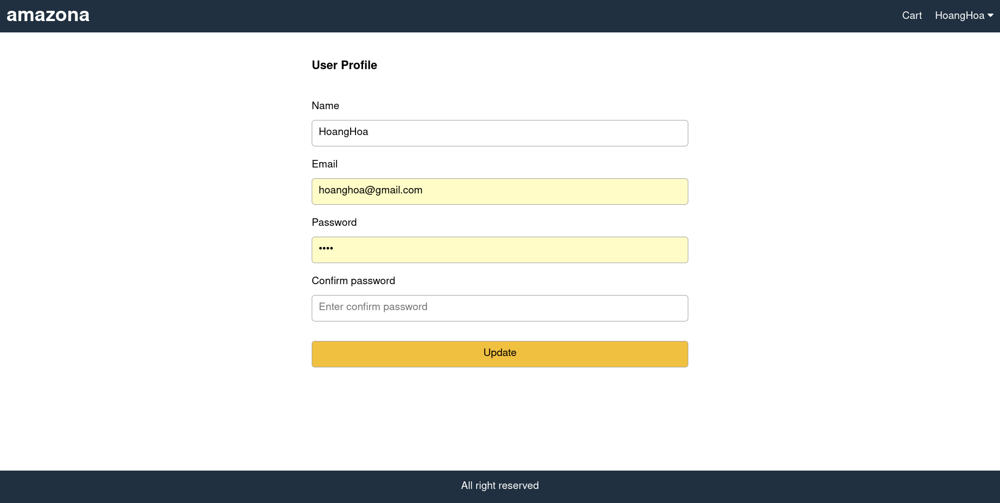
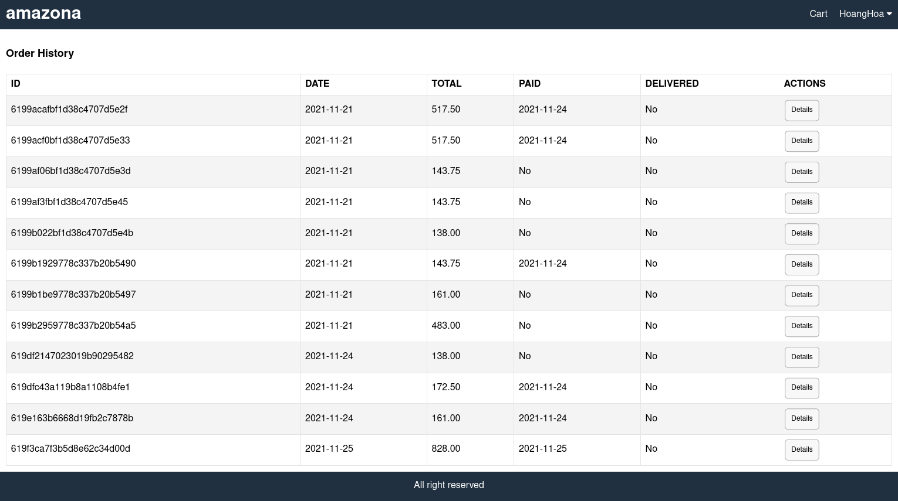
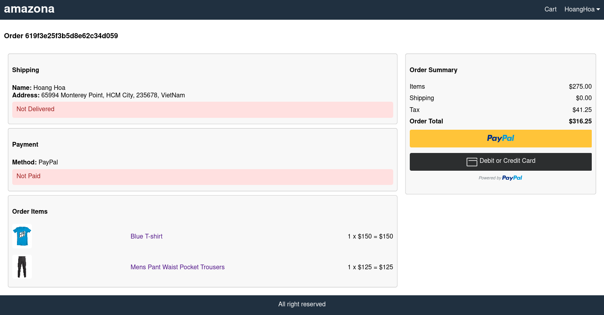

<h1 align="center">
Amazona
</h1>
<p align="center">
MongoDB, ExpressJS, React/Redux, NodeJS
</p>

<p align="center">
   
</p>

> Amazona is a fullstack implementation in MongoDB, Expressjs, React/Redux, Nodejs.

Amazona is the e-commerce app using Javascript/Node for fullstack web development.

## Clone or Download

```terminal
$ git clone https://github.com/hoanghoa12345/amazona-app.git
$ npm i
```

## project structure

```terminal
README.md
package.json
backend/
   models/
   routers/
   server.js
   utils.js
   package.json
   .env
frontend/
   src/
   package.json
template/
   index.html
   style.css
   images/
...
```

# Usage (run Amazona app on your machine)

## Prerequisites

- [MongoDB](https://gist.github.com/nrollr/9f523ae17ecdbb50311980503409aeb3)
- [Node](https://nodejs.org/en/download/) ^10.0.0
- [npm](https://nodejs.org/en/download/package-manager/)

notice, you need client and server runs concurrently in different terminal session, in order to make them talk to each other

## Frontend usage(PORT: 3000)

```terminal
$ cd client   // go to client folder
$ npm i       // npm install packages
$ npm start // run it locally

// deployment for client app
$ npm run build // this will compile the react code using webpack and generate a folder called docs in the root level
$ npm start // this will run the files in docs, this behavior is exactly the same how gh-pages will run your static site
```

## Backend usage(PORT: 5000)

### Prepare your secret

run the script at the first level:

(You need to add a JWT_SECRET in .env to connect to MongoDB)

```terminal
// in the root level
$ echo "JWT_SECRET=YOUR_JWT_SECRET" >> .env
```

If you want pay order with PayPal add PAYPAL_CLIENT_ID to .env file.

### Start

```terminal
$ cd backend   // go to backend folder
$ npm i       // npm install packages
$ npm run dev // run it locally
$ npm run build // this will build the backend code to es5 js codes and generate a dist file
```

## Deploy Server to [Heroku](https://dashboard.heroku.com/)

```terminal
$ npm i -g heroku
$ heroku login
...
$ heroku create
$ npm run heroku:add <your-super-amazing-heroku-app>
// remember to run this command in the root level, not the server level, so if you follow the documentation along, you may need to do `cd ..`
$ pwd
/Users/<your-name>/amazona
$ npm run deploy:heroku
```

### After creating heroku

remember to update the file of [client/webpack.prod.js](https://github.com/amazingandyyy/mern/blob/master/client/webpack.prod.js)

```javascript
 'API_URI': JSON.stringify('https://your-super-amazing-heroku-app.herokuapp.com')
```

# Dependencies(tech-stacks)

| Client-side                    | Server-side                   |
| ------------------------------ | ----------------------------- |
| axios: ^0.23.0                 | bcryptjs: ^2.4.3              |
| react-paypal-button-v2: ^2.6.3 | eslint: ^8.1.0                |
| react-scripts: ^4.0.3          | jsonwebtoken: ^8.5.1          |
| react: ^17.0.2                 | dotenv: ^2.0.0                |
| react-dom: ^17.0.2             | express: ^4.14.0              |
| react-redux: ^7.2.5            | express-async-handler: ^1.2.0 |
| react-router-dom: ^5.3.0       | mongoose: ^6.0.13             |
| redux: ^4.1.1                  | nodemon: ^2.0.14              |
| redux-thunk: ^2.3.0            |

# Screenshots of this project

User visit public and Home page


User profile screen


After signing in user can go to history order to see list orders.


User can pay order using PayPal.


## Standard

[](https://github.com/standard/standard)

## BUGs when install

[Create new Issues](https://github.com/hoanghoa12345/amazona-app/issues) (preferred)

## Author

[Hoang Hoa](https://github.com/hoanghoa12345)

### Thank for Coding with Basir Tutorial

[Coding with Basir](https://www.youtube.com/channel/UC2xRE4hUCQ3xO3ymEtMh1Hw)
